<div align="center">


# Hey, I'm Siddhant Kadam 👋

**Full-Stack Engineer** · Platform Infrastructure · Distributed Systems

Grateful to be building solutions that make systems smarter, faster, and more reliable.  
Dedicated to crafting real-world applications that drive automation, improve user experience, and optimize performance.

[](https://siddh-portfolio.vercel.app)
[](https://www.linkedin.com/in/siddhant-kadam/)
[](mailto:siddh4194@gmail.com)
[](https://github.com/Siddh4194)

</div>

---

## 💼 Work Experience

### 🚀 Software Developer — Krishworks Technology *(June 2024 – Present)*

Leading platform infrastructure work across multiplayer gaming, IoT fleet management, and SaaS systems:

<details>
<summary>⚡ Infrastructure & Performance</summary>

- ⚡ Reduced Firebase read costs by **80%** by designing a Redis caching layer with optimized access patterns — enabling game server scalability without increasing DB spend
- 🔧 Migrated high-volume logging to **InfluxDB time-series architecture**, cutting API response latency by **~500ms** and unlocking real-time telemetry monitoring
- 🎮 Led multiplayer game infra team — delivered a **1-month project in 1.5 weeks (25% faster)**, resolving Redis concurrency bottlenecks. Reduced CPU by **35%**, supporting **200 concurrent sessions** on a 2GB server

</details>

<details>
<summary>📡 IoT & Device Management</summary>

- 📡 Built end-to-end **OTA update pipeline** for a Raspberry Pi fleet — React frontend + Golang backend + deployment scripts. Zero-downtime firmware updates across production devices
- 🌐 Architected **multi-tenant MQTT communication** with user-level ACL rules + API-key auth, reducing auth latency via caching and securing device connections at scale

</details>

<details>
<summary>🔐 Security & Platform Reliability</summary>

- 🔐 Identified malicious code injection incidents and led full security hardening: deployed **Google Cloud Armor** DDoS protection, rotated credentials via **Secret Manager**, enforced IAM policies, and established **GPG-signed commits** across all repositories
- 🛡️ Owned **GitHub org governance** — branch protection, required review gates, mandatory CI checks — improving release reliability and eliminating unsafe production merges

</details>

<details>
<summary>🖥️ Frontend & Developer Experience</summary>

- 🖥️ Built SaaS admin dashboard using **TypeScript + Next.js 19** with React 19 async patterns (Server Components, Suspense) — delivered ahead of schedule and adopted as **team-wide frontend architecture standard**
- 🌍 Implemented **multilingual frontend caching** via IndexedDB, reducing page load times by **1.4 seconds** for international users

</details>

### 🌐 Full Stack Developer — Work Technologies *(Jan 2024 – Mar 2024 · Freelance)*

- Architected and delivered **2 production-ready client applications** using React and Node.js
- **CRT Bionics** — admin dashboard + payment integration, boosted performance and UX · [Live](https://ctopindia.com/)
- **Work Technologies** — responsive UI using TailwindCSS and React · [Live](https://worktechnologies.co.in)

---

## 🔨 Currently Building (Personal Project)

> **AI Agent — Autonomous Load Balancer Monitor & Diagnostician** `[In Progress]`

An intelligent agent that continuously monitors a load balancer and its nodes. When a node turns unhealthy, the agent autonomously SSHes into the server, diagnoses the root cause (CPU spike, memory exhaustion, disk full, crashed process, etc.), and reports findings — reducing MTTR without human intervention.

 


```
Monitor nodes → Detect unhealthy state → SSH into server → Diagnose root cause → Report / Auto-remediate
```

`AI Agent` `Infrastructure Automation` `Go` `LLM` `Distributed Systems` `SRE`

---

## 🧠 Projects

| Project | Description | Stack |
|---|---|---|
| [NMCOE AI Agent](https://aptous-nmce.vercel.app/) | AI agent answering college-specific queries with contextual awareness | LLM, Few-shot prompting |
| [3rd Step Verification](https://github.com/Siddh4194/3rdStepVerification) | Blockchain-based multi-step auth using cryptographic hash keys | Blockchain, Cryptography |
| [Speech to Doc](https://github.com/Siddh4194/Speec-To-Doc) | Voice-command tool for note-making and PDF generation — built for accessibility | Web Speech API, JS |

---

## ⚙️ Tech Stack

**Languages**


**Frontend**


**Backend**


**Databases**


**DevOps & Cloud**


**IoT & Distributed Systems**


---

## 🎓 Education

**B.Tech – Computer Science & Engineering**  
Nanasaheb Mahadik College of Engineering, Sangli · CGPA: **8.00** · 2020–2024

---

<div align="center">

*"Build for scale. Secure by default. Ship with confidence."*


</div>
